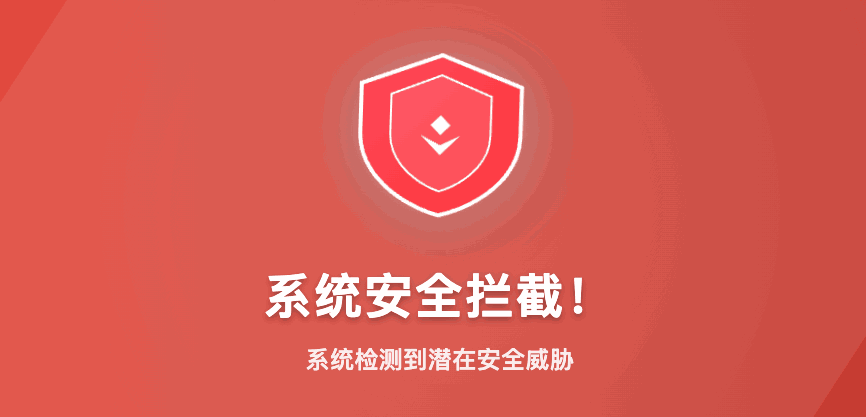

<p align="center">
  <a href="https://www.yoc.cn">
    <picture>
      
    </picture>
  </a>
</p>

# Laravel Security Middleware - Laravel 安全拦截中间件

     

高级安全拦截中间件包，为Laravel应用提供全面的安全防护。

## 📦 安装

```bash
composer require zxf/security
```
 ## 🚀 使用方法

### 发布
```bash

# 一键安装（推荐）
php artisan security:install
# 等同于
php artisan vendor:publish --provider="zxf\Security\Providers\SecurityServiceProvider"

# 强制安装（覆盖现有文件）
php artisan security:install --force

# 安装但不运行迁移
php artisan security:install --no-migrate

# 仅发布配置文件
php artisan vendor:publish --tag=security-config

# 仅发布数据迁移
php artisan vendor:publish --tag=security-migrations
```


## 安全中间件包含的功能清单

### 1、基础安全控制

- **开关控制**：支持全局启用/禁用安全中间件
- **运行模式**：支持全局防护或路由级防护
- **本地环境豁免**：可配置是否忽略本地环境的请求
- **日志记录**：可配置不同级别的安全事件日志记录

### 2、访问频率控制

- **速率限制**：防止暴力破解和DDoS攻击
- **多时间窗口限制**：支持分钟、小时、天级别的请求频率限制
- **指纹识别策略**：支持基于IP、User-Agent、请求路径等多种方式识别客户端
- **自定义识别**：支持自定义客户端指纹生成逻辑

### 3、IP智能管理

- **自动威胁检测**：自动识别可疑IP并评分
- **动态黑名单**：威胁评分达标时自动加入黑名单
- **智能评分系统**：根据行为动态调整威胁评分
- **记录自动清理**：支持过期监控记录的自动清理

### 4、请求方法验证

- **合法方法检查**：只允许预设的HTTP方法访问
- **可疑方法识别**：识别并拦截潜在的恶意HTTP方法

### 5、请求内容安全扫描

- **恶意内容检测**：通过正则表达式检测请求体中的恶意内容
- **白名单机制**：特定路径可跳过内容检查
- **长度阈值控制**：只对达到一定长度的内容进行检测

### 6、URL路径安全

- **非法路径检测**：检测并拦截包含非法字符的URL
- **白名单路径**：特定资源文件可跳过安全检测
- **长度限制**：限制最大URL长度，防止缓冲区攻击

### 7、客户端识别控制

- **User-Agent检查**：识别并拦截可疑的User-Agent
- **白名单爬虫**：允许合法的搜索引擎爬虫访问
- **空UA控制**：可配置是否允许无User-Agent的请求
- **长度限制**：限制User-Agent最大长度

### 8、请求头安全检查

- **可疑头检测**：识别包含可疑内容的请求头
- **数量限制**：限制请求头最大数量，防止头溢出攻击

### 9、文件上传防护

- **扩展名过滤**：禁止危险文件扩展名上传
- **MIME类型过滤**：禁止危险MIME类型的文件上传
- **大小限制**：限制上传文件最大体积
- **内容扫描**：可选的文件内容安全检查
- **白名单机制**：允许特定的安全文件类型

### 10、高级攻击检测

- **异常行为检测**：检测异常的请求参数和行为模式
- **SQL注入防护**：专项检测SQL注入攻击
- **XSS攻击防护**：专项检测跨站脚本攻击
- **命令注入防护**：专项检测系统命令注入攻击

### 11、缓存与封禁机制

- **结果缓存**：缓存安全检查结果提升性能
- **智能封禁**：根据不同安全事件类型设置不同的封禁时长
- **封禁时长限制**：防止设置过长的封禁时间

### 12、响应处理

- **异常处理**：安全中间件异常时的处理策略
- **AJAX响应**：针对API请求的标准化JSON响应
- **错误页面**：支持自定义拦截页面
- **状态码映射**：不同安全事件返回相应的HTTP状态码

### 13、自定义扩展

- **自定义处理**：支持注入自定义安全检查逻辑
- **黑白名单处理**：可自定义黑白名单检查逻辑
- **安全警报**：支持自定义安全警报发送机制

### 14、防御层管理

- **分层防护**：支持按需启用/禁用各个防御层
- **灵活配置**：可独立控制IP检查、方法检查、内容检查等各个防护模块

### 15、其他特性

- **API模式优化**：针对API请求的响应优化
- **代理支持**：支持配置信任的代理服务器
- **性能优化**：递归深度控制，防止栈溢出攻击

### 16、配置管理

- **环境变量覆盖**：支持通过环境变量动态调整配置
- **动态配置源**：支持使用类方法、闭包、数组等多种配置方式
- **完整类型提示**：所有配置项都有明确的类型定义和默认值

该安全中间件提供了从基础访问控制到高级攻击防护的全方位安全防护能力，支持灵活的配置和扩展，可适应不同应用场景的安全需求。
